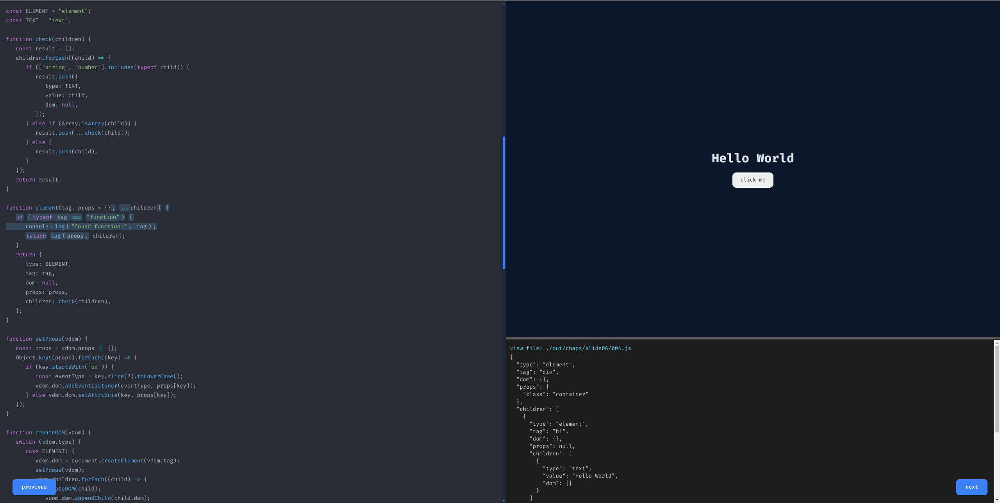

# Build Your Own Framework
+ Create a **mini frontend framework** step by step using **TypeScript**.
+ 👉 Live Demo: https://mohammedhrima.github.io/build-your-own-frontend-framework/

## 🚀 Overview
+ This is an interactive coding presentation that walks you through the process of building a frontend framework from scratch. It is designed to be educational, practical, and beginner-friendly, focusing on core concepts behind modern JavaScript frameworks like React, Vue, and others.
+ Each step is presented as a small, digestible lesson with live code examples and visual output.

## ✨ Features
📚 Step-by-step learning – Navigate through chapters using Next and Previous buttons.

💻 Live Code Preview – Left side shows the code example.

🖼️ Live Output View – Right side renders the result of the current code.

🧠 Hands-on education – See how each change affects the output as you build along.

📁 Check the `./chaps` directory for each stage of the implementation.

---

## 📦 Installation (Optional for local run)
If you'd like to run it locally:

```bash
    git clone https://github.com/mohammedhrima/build-your-own-frontend-framework.git
    cd build-your-own-frontend-framework
    npm install
    npm start
```
+ then open `index.html` using live server

## 🧭 How to Use
- Open the demo link.
- Click on the Next button to move to the next coding step.
- Observe the code changes on the left and how the output is updated on the right.
- Go back with the Previous button anytime.

## 🧭 Navigation
+ Click the Next and Previous buttons to move between slides.
+ Or use your Left (←) and Right (→) arrow keys for keyboard navigation.

## 📖 Topics Covered
- Virtual DOM basics
- JSX rendering
- Component architecture
- State management
- Re-rendering logic
- And more…

## 📸 Preview
<p align="center">
  
</p>
