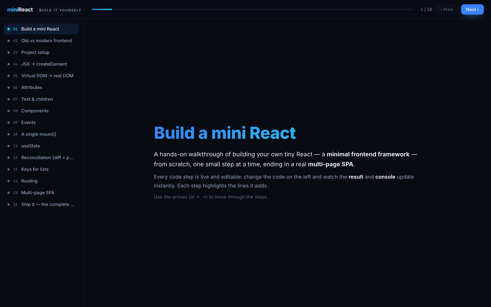
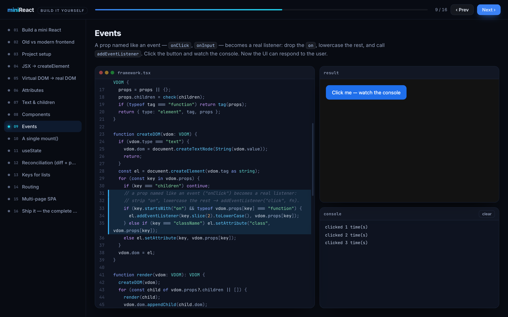
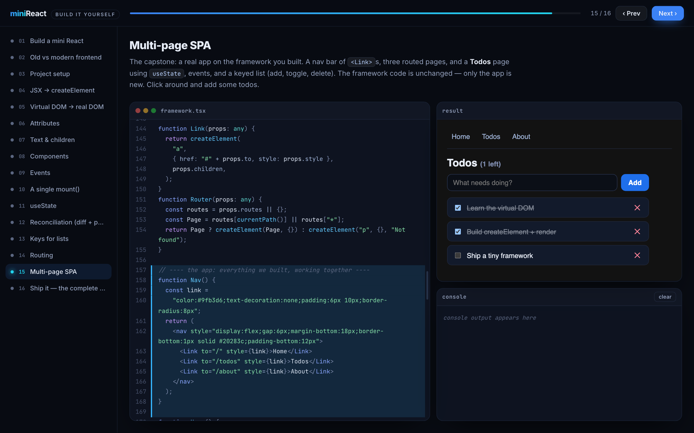
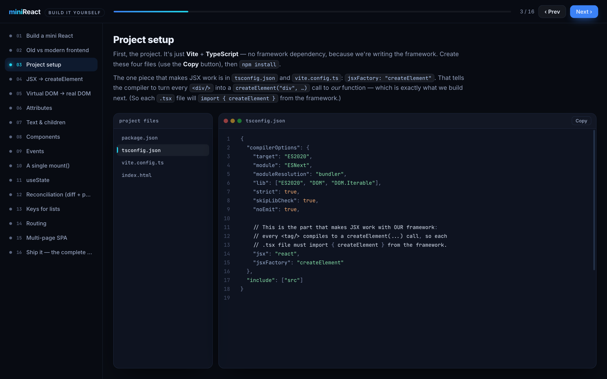
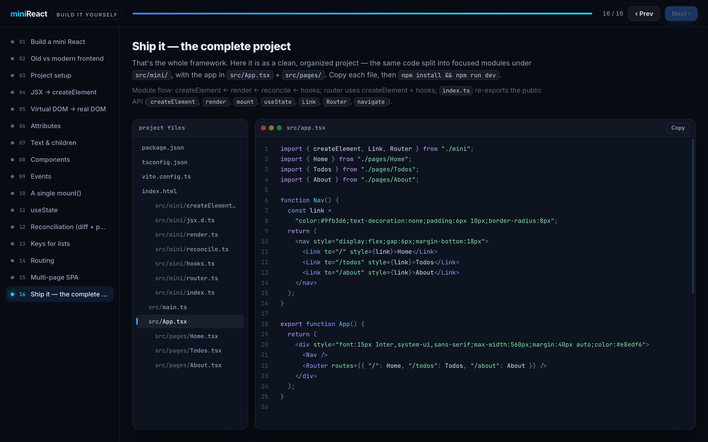

# Build Your Own Frontend Framework

An **interactive, step-by-step tutorial** that teaches you to build your own
minimal React-like SPA framework from scratch — virtual DOM, a reconciler,
`useState`, and a router — ending in a real **multi-page single-page app**.

Everything runs in the browser. You read each step, **edit the code live**, and
watch the result update instantly.



## An interactive playground, not a slideshow

Every build step is a live, editable **3-pane playground** — **editor · result ·
console**. Change the code on the left and the rendered result and the captured
`console.log` output update as you type. The lines each step **adds are
highlighted** and scrolled into view, and the teaching comments for the new code
disappear once you move on — so older code stays clean.



## What you build

A tiny React, in ~150 lines, with **zero dependencies**:

- `createElement` — JSX compiles to plain virtual-DOM objects
- `render` — turn the virtual DOM into real DOM and mount it
- attributes, text nodes, children, and function **components**
- **events** (`onClick` → `addEventListener`)
- `mount()` + **`useState`** (real hooks: a hook list matched by call order)
- a **reconciliation algorithm** (diff + patch) that updates only what changed,
  with **keys** so lists keep their identity
- a tiny **hash router** — `navigate`, `<Link>`, `<Router>`

It all comes together in a **multi-page SPA** (Home / Todos / About) with a
working todo app — add, toggle, delete, on a keyed list:



## It teaches the setup, too

So you can reproduce the project yourself, the tutorial shows the exact config
that makes JSX compile to *your* `createElement` (the `jsxFactory` setting in
`tsconfig.json` / `vite.config.ts`) — every file copy-paste ready.



## ...and ships the complete project

The final step is the whole framework as a clean, organized project — split into
focused modules under `src/mini/` with the app in `src/App.tsx` + `src/pages/`.
Copy each file, run `npm install && npm run dev`, and you have a working SPA on a
framework you built yourself.



## Run it

```bash
npm install
npm run dev
```

Then open the printed `localhost` URL. Use the arrows, the `← →` keys, or the
step list to navigate.

```bash
npm run build     # production build
npm run preview   # preview the build
```

## How it works

- **[Vite](https://vitejs.dev)** for the dev server and build.
- **[CodeMirror 6](https://codemirror.net)** for the editable editor and the
  read-only file viewers on the reference slides.
- Each step's TypeScript + JSX is compiled **in the browser** with the
  TypeScript compiler (`ts.transpileModule`, `jsxFactory: "createElement"`) and
  run inside an isolated iframe; its `console` output is piped back into the
  console pane.

```
src/
├─ app/
│  ├─ shell.ts     # the deck: top bar, step rail, slides, navigation
│  ├─ editor.ts    # CodeMirror editor + read-only viewer
│  ├─ runner.ts    # in-browser compile + isolated iframe + console capture
│  ├─ diff.ts      # line diff for the added-line highlight
│  └─ style.css
├─ steps/
│  └─ steps.ts     # the curriculum: every step + its code snapshot
└─ main.ts
```

## The 16 steps

1. Build a mini React — intro
2. Old vs modern frontend
3. Project setup
4. JSX → `createElement`
5. Virtual DOM → real DOM
6. Attributes
7. Text & children
8. Components
9. Events
10. A single `mount()`
11. `useState`
12. Reconciliation (diff + patch)
13. Keys for lists
14. Routing
15. Multi-page SPA
16. Ship it — the complete project
